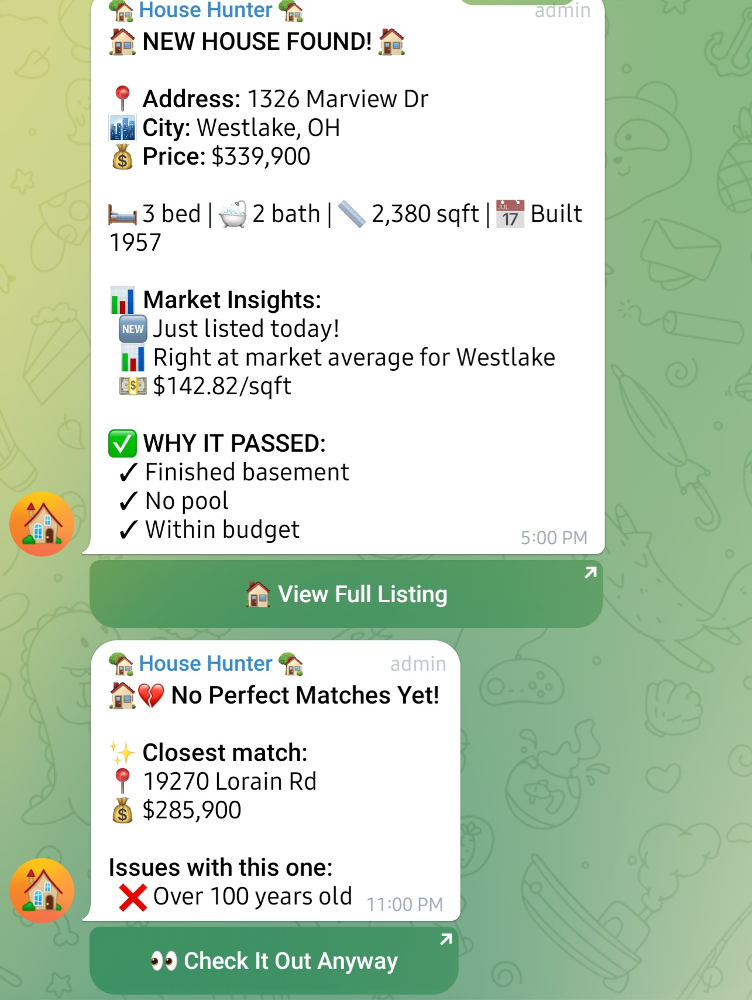

# House Hunter

Automated house search that scrapes listings, filters them with GPT-4o-mini, and pings me on Telegram when something good comes up.

I built this because I was tired of checking Zillow/Realtor every day. It runs on a schedule on an AWS EC2 instance, remembers what it's already seen, and only updates me when there's a close/complete match.

## What it looks like

Heavy on the emojis since it's a personal project, but it makes the notifications easy to scan at a glance.



## How it works

Three agents wired together with LangGraph:

```
Scraper → Reviewer → Summarizer
   │          │           │
Realtor    GPT-4o-mini  Telegram
  API      analysis     notifications
   │          │           │
   └──────────┴───────────┘
              │
          SQLite DB
       (dedup + price
         tracking)
```

**Scraper** hits the Realtor API via RapidAPI. Does a query per city, filters client-side by price, then fetches full details only for what survives. Caps at 40 API calls per run to stay within the pro tier (10k/month).

**Reviewer** does a quick pass first (price, location, age, pool - instant rejection) then sends survivors to GPT-4o-mini for deeper analysis. It checks for finished basements specifically since the API data is inconsistent about that - sometimes it's in `details`, sometimes in `features`, sometimes only in the description text.

**Summarizer** formats the results and sends them to Telegram with inline "View Listing" buttons. Also includes some market context (days on market, price vs. city average). If nothing passes on a run, it'll send the closest miss so I know what's out there.

The whole thing is tracked via SQLite so it won't re-notify me about the same property, and it tracks price history so it can alert on price drops.

## Setup

```bash
git clone https://github.com/YOUR_USERNAME/house-hunter.git
cd house-hunter
cp .env.example .env   # fill in your API keys
pip install -e .
```

You'll need three things:
- **OpenAI API key** for the GPT-4o-mini reviewer ([get one here](https://platform.openai.com/api-keys))
- **RapidAPI key** for the Realtor API Data endpoint ([sign up](https://rapidapi.com/nusantaracodedotcom/api/realtor-api-data), free tier is 10k calls/month)
- **Telegram bot** - create one via [@BotFather](https://core.telegram.org/bots#how-do-i-create-a-bot), then get your chat ID from the `/getUpdates` endpoint

Everything else in `.env.example` has sensible defaults.

## Usage

```bash
# single run
python -m house_hunter.main --once

# dry run (no telegram notifications)
python -m house_hunter.main --test

# run on a schedule (8 times/day)
python -m house_hunter.main --scheduler

# check the database
python -m house_hunter.main --stats
```

## Deploying to EC2

I run this on a `t3.micro` (free tier eligible). Here's the rough setup:

```bash
# launch an Amazon Linux 2023 or Ubuntu instance, SSH in, then:
sudo yum install python3.11 python3.11-pip git   # Amazon Linux
# or: sudo apt install python3.11 python3.11-venv git  # Ubuntu

git clone https://github.com/YOUR_USERNAME/house-hunter.git
cd house-hunter
python3.11 -m venv venv
source venv/bin/activate
pip install -e .

cp .env.example .env
nano .env   # fill in your keys
```

To keep it running after you disconnect, use systemd:

```bash
sudo tee /etc/systemd/system/house-hunter.service << 'EOF'
[Unit]
Description=House Hunter Scheduler
After=network.target

[Service]
Type=simple
User=ec2-user
WorkingDirectory=/home/ec2-user/house-hunter
ExecStart=/home/ec2-user/house-hunter/venv/bin/python -m house_hunter.main --scheduler
Restart=on-failure
RestartSec=30
EnvironmentFile=/home/ec2-user/house-hunter/.env

[Install]
WantedBy=multi-user.target
EOF

sudo systemctl daemon-reload
sudo systemctl enable house-hunter
sudo systemctl start house-hunter

# check logs
journalctl -u house-hunter -f
```

That's it. It'll start on boot and restart if it crashes. Total cost is ~$0/month on the free tier (the EC2 instance is free, and the API costs depend on the API usage for AI and Realtor API).

## Configuration

All via env vars, see `.env.example` for the full list. The important ones beyond API keys:

- `HOUSE_HUNTER_SUBURBS` - comma-separated cities to search (e.g. `Westlake,Bay Village,Rocky River`)
- `HOUSE_HUNTER_STATE` - two-letter state code, defaults to `OH`
- `HOUSE_HUNTER_MIN_PRICE` / `HOUSE_HUNTER_MAX_PRICE` - price range
- `HOUSE_HUNTER_AVOID_CITIES` - cities to skip even if they show up in results, this was added to catch odd outliers that would sneak through
- `HOUSE_HUNTER_TIMEZONE` - for the scheduler, defaults to `US/Eastern`

Optionally enable [LangSmith](https://smith.langchain.com) tracing if you want to debug the LangGraph workflow.

## Project structure

```
house_hunter/
├── main.py            # CLI entry point
├── graph.py           # LangGraph workflow (scraper → reviewer → summarizer)
├── state.py           # TypedDict definitions shared across agents
├── scraper.py         # Realtor API client + rate limiting
├── scraper_agent.py   # Converts raw API responses to typed PropertyData
├── reviewer.py        # Quick filter + GPT-4o-mini deep review
├── summarizer.py      # Telegram formatting + notifications
├── database.py        # SQLite for dedup, price history, market stats
└── scheduler.py       # APScheduler wrapper
```
